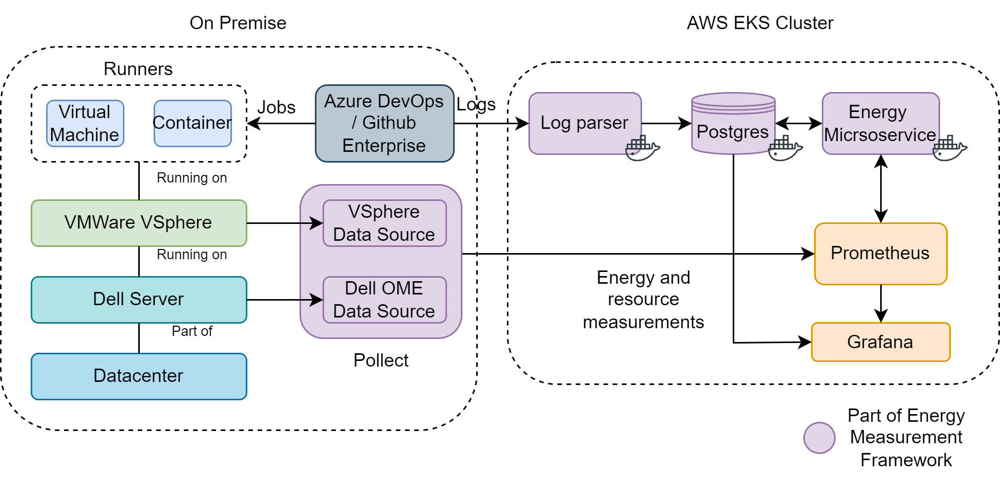

# Planetary
Measurement of energy consumption level on various layers of infrastructure and application components

## Architecture

## Components 

### Log Analyser
- https://github.siemens.cloud/nikolai-limbrunner-ext/log_analyser

### Collectors
- https://github.siemens.cloud/nikolai-limbrunner-ext/collectors
- https://github.siemens.cloud/nikolai-limbrunner-ext/pollect

### Energy calculators
- https://github.siemens.cloud/nikolai-limbrunner-ext/energy_calculator