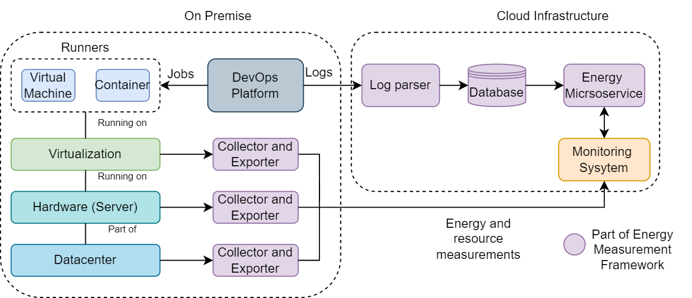

# Planetary
Measurement of energy consumption level on various layers of infrastructure and application components

## Architecture


## Components 
The components are added are submodules to this repository.

```bash
git clone --recursive https://github.siemens.cloud/nikolai-limbrunner-ext/planetary.git
```

### Log Analyser
- https://github.siemens.cloud/nikolai-limbrunner-ext/log_analyser
- 
### Energy calculators
- https://github.siemens.cloud/nikolai-limbrunner-ext/energy_calculator

### Collectors (Pollect)
- https://github.siemens.cloud/nikolai-limbrunner-ext/pollect
